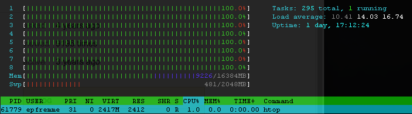

# Challenge 044: Look and Say Sequence

__Goal:__ reach 300 iterations (a.k.a the why does Jansen hate us challenge)

## Description

Application used to process N look-and-say sequences in parallel

Sequences are sent to parallel processing socket servers for processing as the previous sequence iteration completes. So
as sequence results are returned from one server for the sequence they are piped to the next processing server connection
to begin parsing even when the previous iteration is still in flight.

At the expense of reduced performance this offers a more stable rate of memory consumption since we do not need to process
each sequence string in the same thread.

## Benchmarks

__Seed:__ 132

__Iterations:__

 * 10: _73 bytes (1.0895180702209 seconds)_
 * 20: _1,065 bytes (2.1638269424438 seconds)_
 * 30: _15,223 bytes (3.6053788661957 seconds)_
 * 40: _215,633 bytes (6.7548570632935 seconds)_
 * 50: _3,054,783 bytes (35.074362039566 seconds)_
 * 60: _43,284,143 bytes (449.2701048851 seconds)_
 * 70: _~613,334,248 bytes (6370.3320558071 seconds)_ 
 * 80: _... still running ..._
 

## Install

* `composer install`

## Usage

    Usage:
      php index.php <seed> <iterations>
    
    Arguments:
      seed        Initial seed sequence
      iterations  Number iterations to process
     
## Tests

* __no tests__
